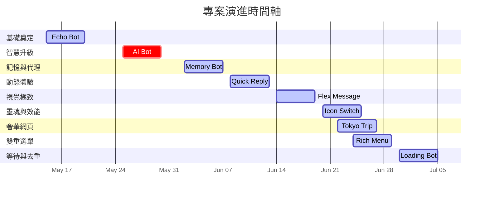

# 🧪 Zona's AI Learning Lab 

歡迎來到我的 AI 探索與實作實驗室！這裡記錄了我與 AI 助理（Google Antigravity）攜手合作，從零開始打造、升級雲端應用程式的精彩歷程。

---

## 📅 專案進化歷程時間軸 (Chronological Project Timeline)

我們採用漸進式學習與開發，從最基礎的串接驗證，逐步演進至多模態大腦與高安全性雲端部署。以下是專案的演進軌跡：

---

### 📍 🚀 第一站：LINE Echo Bot（基礎學舌鳥機器人）
> **起點：從零開始，快速驗證 LINE Messaging API 與雲端基礎串接。**

不懂程式、沒架過伺服器也能輕鬆起步！此專案記錄了如何在短短 20 分鐘內，透過與 AI 助理的完美協作，無痛部署一個穩健的 LINE 訊息回傳機器人。

*   **專案資源：**
    *   
    *   
*   **核心技術：**
    *   `LINE Messaging API` 核心對接
    *   `Google Apps Script (GAS)` 輕量級雲端託管
    *   `AI-Driven Development` 提示詞導向開發
*   **關鍵亮點：**
    *   **20 分鐘快速上線：** 透過對話式開發，免去繁瑣的本機開發環境設定。
    *   **零成本託管：** 善用 Google Apps Script (GAS) 部署為網頁應用程式（Web App），完全免費且高可用。
    *   **無痛除錯：** 示範如何直接將錯誤訊息丟給 AI 進行「對話式除錯（Conversational Debugging）」，打通開發瓶頸。

---

### 📍 🧠 第二站：LINE AI Bot（Gemini 2.5 多模態大腦與免密通關）
> **進階：賦予機器人視覺與智慧，並引進企業級的安全認證架構。**

從「學舌鳥」到「看圖說故事」！僅花費 15 分鐘，便將原本的 Echo Bot 進行脫胎換骨的升級，引入強大的 Gemini 2.5 多模態大型語言模型，並完美實踐雲端免密碼（Passwordless/Secretless）安全整合。

*   **專案資源：**
    *   
    *   
*   **核心技術：**
    *   `Google Gemini 2.5 Flash / Pro` 多模態大型語言模型
    *   `LINE Message Event Handler` 圖像與音訊等多媒體處理
    *   `Secretless Authentication / Workload Identity` 雲端免密通關安全架構
*   **關鍵亮點：**
    *   **15 分鐘極速升級：** 示範如何快速導入強大的 AI 大腦，讓機器人不僅能聊天，還能「讀懂圖片並說故事」。
    *   **多模態處理能力：** 完整實作圖片、文字等多樣化格式輸入的解析，讓互動體驗大幅精進。
    *   **企業級免密通關：** 揚棄在程式碼中寫死（Hardcode）密鑰的危險做法，改採進階的免密安全機制（如 IAM / Workload Identity / Secret Manager 等方式），兼顧開發速度與資安規範。

---

### 📍 🔮 第三站：LINE Memory Bot（長效記憶占星水晶專家）
> **登峰：融合 Agent 框架、永久雲端記憶與多模態分析，打造有溫度的長效智慧助理。**

為了解決雲端 Serverless（如 Cloud Run）無狀態容器重啟導致對話記憶消失的問題，本專案引進了 Google 最新的 **ADK (Agent Development Kit)** 智慧代理框架，並首創自製的中繁體中文記憶體檢索匹配器，將使用者的每一次對話、星盤與水晶特徵永久刻在 **Cloud Firestore**。

*   **專案資源：**
    *   
    *   
*   **核心技術：**
    *   `Google ADK (Agent Development Kit)` 與 `PreloadMemoryTool`
    *   `Google Cloud Firestore` 永久雲端資料庫（`ChineseFirestoreMemoryService`）
    *   `Vertex AI Gemini 2.5 Flash` 多模態影像解析
    *   `Node.js 22` 混血模組相容啟動旗標（`--experimental-require-module`）
*   **關鍵亮點：**
    *   **記憶預載（PreloadMemoryTool）**：只需一行程式碼，在每次對話啟動時自動預載使用者的歷史互動與生日星盤設定。
    *   **獨家中文分詞修補（Chinese Word Segmentation Regex Patch）**：徹底解決 ADK 內建 `InMemoryMemoryService` 僅支援英文分詞的 Bug，實作中繁體中文漢字與占星高頻詞彙的匹配器。
    *   **多模態影像鑑定**：傳送水晶礦石照片，機器人自動轉為 Base64 並透由 Vertex AI Gemini 2.5 Flash 鑑定其脈輪與五行共振特徵。
    *   **長效記憶整合**：在隔了幾天後對話，機器人仍能根據 Firestore 的持久記憶，記住您的生日、星座以及上次傳送的水晶照片特徵，給出高度客製化的諮詢回覆。
    *   **全免密雲端部署**：安全託管於 **Google Cloud Run**，利用 IAM / 應用程式預設憑證（ADC）安全存取 Google 資源，免除硬編碼 API 金鑰的安全漏洞。

---

### 📍 💬 第四站：LINE Quick Reply Bot（動態追問建議與極致對話體驗）
> **精進：根據上下文動態預測使用者下一步，提升互動體驗。**

讓對話更自然、更流暢！本專案的核心在於實現「動態追問機制」，捨棄傳統死板的靜態按鈕選單，由 Gemini 2.5 Flash 在生成對話回答的當下，即時預測最符合當前語境的 3 個第一人稱追問問題，並自動轉換成 LINE 鍵盤上方的 Quick Reply 建議按鈕。

*   **專案資源：**
    *   
    *   
*   **核心技術：**
    *   `Google ADK (Agent Development Kit)` 智慧代理與 PreloadMemoryTool
    *   `Gemini 2.5 Flash` 單回合多目標生成 (回答與追問建議預測)
    *   `LINE Messaging API` 快速回覆鍵盤機制 (`quickReply`)
    *   `Google Cloud Firestore` 永久對話記憶（`ChineseFirestoreMemoryService`）
*   **關鍵亮點：**
    *   **智慧動態追問 (Dynamic Suggestions)**：在對話過程中，由 AI 即時預測並生成 3 個第一人稱的追問選項，點擊即送出，完美契合語境並大幅提升使用者的互動率。
    *   **單回合零額外成本與延遲**：利用 Prompt 精妙設計，指示 Gemini 在回答最後以 `|||` 與 `|` 作為分隔格式，同時生成主回答與建議問題。後端僅需調用一次 API 即可解析完成，兼顧極速效能與控本效益。
    *   **20 字元字數限制過濾**：自動化對接 LINE 官方對 Quick Reply Label 的 20 字元上限。透過 Prompt 雙重約束及後端程式碼字符限制，防範因字數過長被系統截斷的難堪情形。
    *   **智慧 Fallback 機制**：當 LLM 的輸出格式未符預期或分隔符遺漏時，系統將自動套用預設高頻追問按鈕，確保使用者對話歷程在任何極端狀況下皆順暢無阻。

---

### 📍 ✨ 第五站：LINE Flex Message Bot（動態隨機推薦與極致視覺卡片）
> **突破：打造奢華、具互動性的高階 Flex Message，讓對話視覺感拉滿。**

視覺震撼！本專案旨在將互動視覺效果直接拉到極致，設計多款符合現代奢華感、文青風格的高階 Flex Message 卡片，並融入動態隨機洗牌演算機制，給予使用者最尊榮的視覺與互動體驗。

*   **專案資源：**
    *   
    *   
*   **核心技術：**
    *   `LINE Messaging API` 氣泡卡片與輪播展示大廳（`Flex Message Carousel`）
    *   `Fisher-Yates 隨機洗牌演算法`（確保每次觸發不重複隨機提取 3 款卡片）
    *   `Google ADK (Agent Development Kit)` 智慧大腦與 Firestore 記憶整併
    *   `Express` Webhook 精準關鍵字前綴分流（`#水晶` 精準觸發與普通對話分流）
*   **關鍵亮點：**
    *   **奢華視覺三大高階範本**：預建精緻細調的「極簡莫蘭迪數位名片 (Glassmorphism Digital Card)」、「星宇極致登機證 (Luxury Boarding Pass)」與「日系文青下午茶菜單 (Cafe Specialty Menu)」，排版與色彩搭配達到極致美感。
    *   **Fisher-Yates 隨機不重複推薦**：內建七款能量水晶資料庫。透過 Fisher-Yates 洗牌演算法，使用者每次輸入關鍵字時皆能動態獲得 3 款隨機且絕不重複的 Micro-Carousel 精美水晶圖卡。
    *   **雙重大腦合一與防干擾分流**：全面移植了前幾代專案的 ADK 智慧代理、Firestore 永久記憶與 Gemini 多模態影像解析大腦。同時巧妙設計 `#水晶` 前綴觸發 Flex Message，其餘普通關鍵字與照片上傳則無縫交給 AI 占星師大腦進行流暢對話，互不干擾。
    *   **本地端權限衝突繞過**：針對 npm install 快取目錄鎖定問題，提供優雅的 `--cache ./.npm-cache` 專案內隔離快取技術，免除不安全的 sudo 權限要求。

---

### 📍 🪐 第六站：LINE Icon Switch Bot（動態守護神分身與 Cloud Run 效能優化）
> **突破：實作動態 Sender 變更以自由切換對話頭像，並完美克服 Cloud Run CPU 凍結踩坑限制。**

擬真靈魂與極致效能！本專案的核心升級在於實作「動態守護神頭像與暱稱切換（Deity Icon Switch）」，並針對 Google Cloud Run 的 CPU 凍結（CPU Throttling）特性進行了底層 Webhook 異步 Promise 機制的徹底改寫，兼顧多對話情境的沉浸感與雲端執行的超高可用性。

*   **專案資源：**
    *   
    *   
*   **核心技術：**
    *   `LINE Messaging API` 動態寄件者變更（`sender.name` & `sender.iconUrl`）
    *   `Express 靜態路由`（本機託管靜態資源 `/static`，實現零外鏈頭像依賴）
    *   `Google Cloud Run CPU Throttling` 背景執行緒凍結應對方案
    *   `同步 Promise.all` Webhook 異步流程優化
*   **關鍵亮點：**
    *   **動態守護神頭像與暱稱切換**：依據使用者諮詢的主題（如事業、愛情、財運），Gemini 會在回覆最前端附加特定守護神標記（如 `[DEITY: ATHENA]`、`[DEITY: VENUS]` 等）。後端自動解析、剝離該標記，並動態將 LINE 的 `sender.name` 與 `sender.iconUrl` 切換為對應的守護神（雅典娜、維納斯、莫伊萊、艾蓮），對話擬真感與沉浸體驗達到極致。
    *   **靜態資源本機路由安全託管**：頭像圖檔直接存放在本機專案目錄中，透過 Express 開放 `/static` 靜態檔案路由，免去上傳第三方圖床或依賴外鏈的風險，提高自主性與穩定度。
    *   **徹底攻克 Cloud Run 執行緒凍結**：詳細剖析 Cloud Run 預設「僅在請求處理期間分配 CPU」的縮容/凍結機制（CPU Throttling）。如果 Webhook 使用非同步背景執行並秒回 `res.send('OK')`，會導致 Gemini API 呼叫與 Firestore 永久記憶讀寫在回覆送出的瞬間被完全卡死。本專案將 Webhook 調整回穩定的同步 `Promise.all` 等待機制，徹底解決背景任務無反應的業界痛點。

---

### 📍 🗾 第七站：Tokyo Trip Itinerary（東京赤坂商務休閒二日遊奢華網頁）
> **跨界：為三人商務與休閒量身打造的高質感響應式互動行程網頁。**

超齡質感與極致品味！這是一個專為三人東京出差休閒設計的兩日精選行程網頁。網頁摒棄了傳統陽春的條列式排版，採用極致奢華的深色調（Dark Mode）與黃金微光設計，提供流暢的動態效果與響應式互動體驗，完美平衡三位成員的獨特品味與行程需求。

*   **專案資源：**
    *   
    *   
*   **核心技術：**
    *   `HTML5` 語義化標籤與結構設計
    *   `Vanilla CSS` 高階排版（CSS Grid / Flexbox）與 Glassmorphism 磨砂玻璃特效
    *   `JavaScript (ES6+)` 響應式事件監聽、動態展開（Accordion）與互動控制
    *   `Google Maps API` 地圖與精準座標導航對接
*   **關鍵亮點：**
    *   **極致黃金微光暗黑美學**：採用頂級 HSL 精密調色盤與細膩的深色背景，搭配磨砂玻璃、流光漸變邊框與懸停微動畫，為出差行程注入奢華感。
    *   **專屬成員互動介紹與行程分流**：針對三位性格迥異的團隊成員（品味極高預算無上限的主管 E、熱愛科技藝術的 CTO M，以及追求質感與細節的行程規劃者您自己）設計客製化頭像與角色介紹卡片，將商務、米其林餐飲、千本鳥居文化底蘊與 teamLab 數位藝術融合於一體。
    *   **精準地圖導航無縫對接**：網頁中所有精選景點（如菊乃井赤坂店、迎賓館赤坂離宮、鐵板燒 あかさか、teamLab Borderless 等）皆直接串接 Google Maps 經緯度與專屬店家座標，確保三人行在東京赤坂繁華街區穿梭時「零踩雷、不迷路」。
    *   **極速 Cloud Run 一鍵容器化託管**：與前幾站 LINE Bot 一樣，網頁完成後也迅速容器化並一鍵部署至 Google Cloud Run，維持一貫的高效託管與秒級加載水準。

---

### 📍 🎛️ 第八站：LINE Rich Menu Switch Bot（雙選單流暢切換與五宮格導覽升級）
> **突破：實作用戶端無縫雙選單切換，搭配高質感五宮格導覽圖與極致圖片壓縮技術。**

絲滑體驗與極致視覺！本專案的核心在於引進 **LINE 雙選單（Dual Rich Menu）無縫用戶端切換** 機制。透過 LINE 原生的 `richmenuswitch` 動作，配合 `alias_main_menu` 與 `alias_five_grids` 別名切換，實現零延遲、完全離線級的選單跳轉。同時，精心設計了五宮格導覽介面，並採用極致圖片壓縮與格式轉換技術，克服 LINE 1MB 的上傳限制，實現高畫質與高效能的完美平衡。

*   **專案資源：**
    *   
    *   
*   **核心技術：**
    *   `LINE Messaging API` 雙選單切換（`richmenuswitch` 動作 & 豐富選單別名 `Rich Menu Aliases`）
    *   `Rich Menu` 五宮格精準點擊區域配置（2x2 + 1 網格坐標劃分）
    *   `極致圖像縮放與高壓縮率 JPEG 格式轉換`（等比例縮放至 `2500x1686 px` 且小於 `1MB`）
    *   `Node.js & Express / Cloud Run` 後端高質感靜態導覽回覆
*   **關鍵亮點：**
    *   **用戶端零延遲雙選單跳轉**：捨棄伺服器端收到 Postback 再透過 API 重新連結（link）選單的傳統繁複流程，改用手機本地端的 `richmenuswitch` 動作，達成秒級、完全離線無縫切換，為用戶帶來絲滑的使用體驗。
    *   **精美五宮格與雙向導航**：主選單左半部與五宮格導覽完美連動。點擊主選單按鈕瞬間展現「五宮格導覽圖」，點擊底部「回到上一頁」則秒切回主選單。
    *   **高畫質無損極致圖片壓縮**：解決 LINE 官方限制選單圖片必須小於 1MB 的限制，透過專業縮放與 75% 壓縮率轉化（`769KB`），完美在保全絕對 premium 視覺品質下成功上傳，打造兼具效能與美學的選單。
    *   **高精度網格坐標劃分**：在 2500x1686 像素的限制下，精準切割出 5 格區域：Top-Left（閱讀指南）、Top-Right（認識水晶）、Mid-Left（淨化方法）、Mid-Right（功效與佩戴），以及 Bottom（返回主選單），實作強大的多功能點擊觸發機制。

---

### 📍 ⏳ 第九站：LINE Loading Animation Bot（載入中動畫與 Serverless 雙重去重機制）
> **突破：實作載入中動畫展示，並利用高併發雙重快取阻斷機制解決 Serverless 環境下的重複重試痛點。**

極致順暢與零重複干擾！本專案的核心在於引進 **LINE 載入中動畫（Loading Animation）**，為 LLM 等繁重非同步任務提供極致絲滑的等待體驗。同時，針對 Google Cloud Run 在收到回應後 CPU 立即凍結的痛點，實施了 `await Promise.all` 連線保持技術。為了解決連線保持可能導致 LINE 5 秒逾時而自動發起最多 3 次「自動重試（Retry）」的問題，設計了極為精密的**雙重快取防重複去重機制**，確保「僅執行一次 (Exactly-Once)」的高效安全防護。

*   **專案資源：**
    *   
    *   
*   **核心技術：**
    *   `LINE Messaging API` 載入中動畫（`showLoadingAnimation` API，自動依回應發送而動態消失）
    *   `Serverless 請求連線保持`（`await Promise.all(...)` 鎖定 Cloud Run CPU 資源不被凍結）
    *   `雙重快取去重機制`（藉由處理中 `activeEvents` 與已完成 `completedEvents` 雙重 Set 完美防重複）
    *   `記憶體自動管理`（10 分鐘定時排程自動釋放去重快取，防堵高併發 Memory Leak）
*   **關鍵亮點：**
    *   **絲滑無縫等待體驗**：在後端處理 Gemini 2.5 Flash 多模態推論等繁重工作時，自動發起載入動畫。用戶可在聊天視窗中看見自然的「讀取中/正在輸入」動畫。當後端推送訊息後，動畫即秒速、自動消失，大幅消除用戶焦慮感。
    *   **徹底攻克 Serverless CPU 凍結**：詳細剖析 Cloud Run 等平台「一回傳 200 即回收/凍結 CPU 執行緒」的特性，透過 HTTP 連線保持技術，迫使平台在整個 AI 分析與回覆過程中始終給予足夠 CPU 運算資源。
    *   **雙重快取阻斷 5 秒超時重試**：由於連線保持使 Webhook 回應時間拉長，容易觸發 LINE 的 5 秒重試機制。本專案透過 `activeEvents` 與 `completedEvents` 建立雙層屏障，第二、三次重試進入時，秒速偵測、阻斷並回傳 `200 OK` 拋棄，完美確保後端重度 LLM 任務不被重複觸發與計費。
    *   **高併發記憶體自動防溢出**：內建定時的排程清理器，每 10 分鐘自動釋放已完成與處理中的快取集合，兼顧了全天候高頻次查詢去重需求，又完美保障了內存安全。

---

## 🛠️ 實驗室技術雷達 (Tech Stack Radar)

在本實驗室中，我們廣泛運用並實踐了以下技術棧：

| 領域 | 採用技術與服務 |
| :--- | :--- |
| **通訊渠道 (Messaging)** | LINE Messaging API (Dynamic Sender / Client-side Rich Menu Switch / Loading Animation), Rich Menu (2x2+1 Grid / High Compress), Flex Message (Carousel), Quick Reply, Blob API |
| **人工智慧 (AI/LLM)** | Google ADK, PreloadMemoryTool, Gemini 2.5 Multimodal (Flash/Pro) |
| **雲端部署 (Deployment)** | Cloud Run (CPU Throttling Avoidance / Connection Holding), Google Apps Script, Vercel / Render |
| **資料記憶 (Database/Memory)**| Cloud Firestore, ChineseFirestoreMemoryService (中文分詞檢索) |
| **資訊安全 (Security)** | Application Default Credentials (ADC), IAM, Secretless Auth, Exactly-Once Deduplication (雙重快取去重) |
| **開發語言與環境** | Node.js 22 (--experimental-require-module), ESM/CJS, Express Static, Vanilla HTML/CSS/JS |
| **輔助開發 (AI Copilot)** | Cursor, ChatGPT, Claude |

---

## 🤝 聯絡與社群

如果您對 AI 輔助開發、LINE Bot 實作或多模態應用有興趣，歡迎隨時透過以下渠道與我交流！

- **Medium 部落格：** [@zonawang](https://medium.com/@zonawang)
- **GitHub 主頁：** [zonawang](https://github.com/zonawang)
