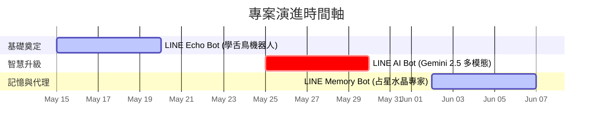

# 🧪 Zona's Learning Lab 

歡迎來到我的 AI 探索與實作實驗室！這裡記錄了我與 AI 助理（Pair Programming）攜手合作，從零開始打造、升級雲端應用程式的精彩歷程。

---

## 📅 專案進化歷程時間軸 (Chronological Project Timeline)

我們採用漸進式學習與開發，從最基礎的串接驗證，逐步演進至多模態大腦與高安全性雲端部署。以下是專案的演進軌跡：

---

### 📍 🚀 第一站：LINE Echo Bot（基礎學舌鳥機器人）
> **起點：從零開始，快速驗證 LINE Messaging API 與雲端基礎串接。**

不懂程式、沒架過伺服器也能輕鬆起步！此專案記錄了如何在短短 20 分鐘內，透過與 AI 助理的完美協作，無痛部署一個穩健的 LINE 訊息回傳機器人。

*   **專案資源：**
    *   
    *   
*   **核心技術：**
    *   `LINE Messaging API` 核心對接
    *   `Google Apps Script (GAS)` 輕量級雲端託管
    *   `AI-Driven Development` 提示詞導向開發
*   **關鍵亮點：**
    *   **20 分鐘快速上線：** 透過對話式開發，免去繁瑣的本機開發環境設定。
    *   **零成本託管：** 善用 Google Apps Script (GAS) 部署為網頁應用程式（Web App），完全免費且高可用。
    *   **無痛除錯：** 示範如何直接將錯誤訊息丟給 AI 進行「對話式除錯（Conversational Debugging）」，打通開發瓶頸。

---

### 📍 🧠 第二站：LINE AI Bot（Gemini 2.5 多模態大腦與免密通關）
> **進階：賦予機器人視覺與智慧，並引進企業級的安全認證架構。**

從「學舌鳥」到「看圖說故事」！僅花費 15 分鐘，便將原本的 Echo Bot 進行脫胎換骨的升級，引入強大的 Gemini 2.5 多模態大型語言模型，並完美實踐雲端免密碼（Passwordless/Secretless）安全整合。

*   **專案資源：**
    *   
    *   
*   **核心技術：**
    *   `Google Gemini 2.5 Flash / Pro` 多模態大型語言模型
    *   `LINE Message Event Handler` 圖像與音訊等多媒體處理
    *   `Secretless Authentication / Workload Identity` 雲端免密通關安全架構
*   **關鍵亮點：**
    *   **15 分鐘極速升級：** 示範如何快速導入強大的 AI 大腦，讓機器人不僅能聊天，還能「讀懂圖片並說故事」。
    *   **多模態處理能力：** 完整實作圖片、文字等多樣化格式輸入的解析，讓互動體驗大幅精進。
    *   **企業級免密通關：** 揚棄在程式碼中寫死（Hardcode）密鑰的危險做法，改採進階的免密安全機制（如 IAM / Workload Identity / Secret Manager 等方式），兼顧開發速度與資安規範。

---

### 📍 🔮 第三站：LINE Memory Bot（長效記憶占星水晶專家）
> **登峰：融合 Agent 框架、永久雲端記憶與多模態分析，打造有溫度的長效智慧助理。**

為了解決雲端 Serverless（如 Cloud Run）無狀態容器重啟導致對話記憶消失的問題，本專案引進了 Google 最新的 **ADK (Agent Development Kit)** 智慧代理框架，並首創自製的中繁體中文記憶體檢索匹配器，將使用者的每一次對話、星盤與水晶特徵永久刻在 **Cloud Firestore**。

*   **專案資源：**
    *   
    *   
*   **核心技術：**
    *   `Google ADK (Agent Development Kit)` 與 `PreloadMemoryTool`
    *   `Google Cloud Firestore` 永久雲端資料庫（`ChineseFirestoreMemoryService`）
    *   `Vertex AI Gemini 2.5 Flash` 多模態影像解析
    *   `Node.js 22` 混血模組相容啟動旗標（`--experimental-require-module`）
*   **關鍵亮點：**
    *   **記憶預載（PreloadMemoryTool）**：只需一行程式碼，在每次對話啟動時自動預載使用者的歷史互動與生日星盤設定。
    *   **獨家中文分詞修補（Chinese Word Segmentation Regex Patch）**：徹底解決 ADK 內建 `InMemoryMemoryService` 僅支援英文分詞的 Bug，實作中繁體中文漢字與占星高頻詞彙的匹配器。
    *   **多模態影像鑑定**：傳送水晶礦石照片，機器人自動轉為 Base64 並透由 Vertex AI Gemini 2.5 Flash 鑑定其脈輪與五行共振特徵。
    *   **長效記憶整合**：在隔了幾天後對話，機器人仍能根據 Firestore 的持久記憶，記住您的生日、星座以及上次傳送的水晶照片特徵，給出高度客製化的諮詢回覆。
    *   **全免密雲端部署**：安全託管於 **Google Cloud Run**，利用 IAM / 應用程式預設憑證（ADC）安全存取 Google 資源，免除硬編碼 API 金鑰的安全漏洞。

---

## 🛠️ 實驗室技術雷達 (Tech Stack Radar)

在本實驗室中，我們廣泛運用並實踐了以下技術棧：

| 領域 | 採用技術與服務 |
| :--- | :--- |
| **通訊渠道 (Messaging)** | LINE Messaging API, Rich Menu, Flex Message, Blob API |
| **人工智慧 (AI/LLM)** | Google ADK, PreloadMemoryTool, Gemini 2.5 Multimodal (Flash/Pro) |
| **雲端部署 (Deployment)** | Cloud Run, Google Apps Script, Vercel / Render |
| **資料記憶 (Database/Memory)**| Cloud Firestore, ChineseFirestoreMemoryService (中文分詞檢索) |
| **資訊安全 (Security)** | Application Default Credentials (ADC), IAM, Secretless Auth |
| **開發語言與環境** | Node.js 22 (--experimental-require-module), ESM/CJS |
| **輔助開發 (AI Copilot)** | Cursor, ChatGPT, Claude |

---

## 🤝 聯絡與社群

如果您對 AI 輔助開發、LINE Bot 實作或多模態應用有興趣，歡迎隨時透過以下渠道與我交流！

- **Medium 部落格：** [@zonawang](https://medium.com/@zonawang)
- **GitHub 主頁：** [zonawang](https://github.com/zonawang)
