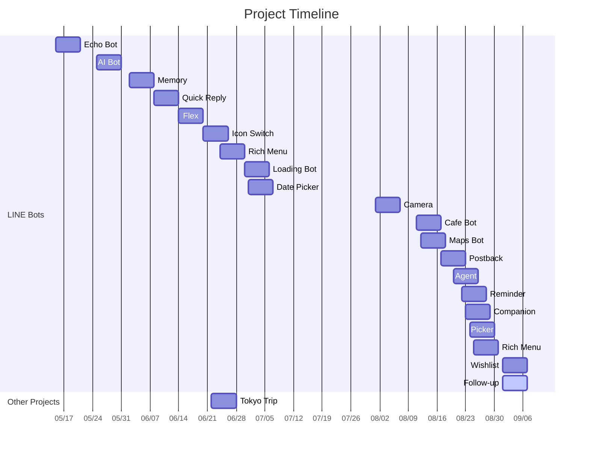

# 🧪 Zona's AI Learning Lab 

歡迎來到我的 AI 探索與實作實驗室！這裡記錄了我與 AI 助理（Google Antigravity、Codex 等）攜手合作，從零開始打造、升級雲端應用程式的精彩歷程。

## ✍️ 專題文章

- [不是越強越好：我用 Codex Sol、Terra、Luna 做完四次實作後，學會先看「任務的形狀」](codex-sol-terra-luna.md)
- [Codex CLI 和 App 該怎麼選？從只看終端輸出，到真正看見成品](codex-cli-vs-app.md)

---

## 📅 專案進化歷程時間軸 (Chronological Project Timeline)

我們採用漸進式學習與開發，從最基礎的串接驗證，逐步演進至多模態大腦與高安全性雲端部署。以下是專案的演進軌跡：

```mermaid
gantt
    title Project Timeline
    dateFormat YYYY-MM-DD
    axisFormat %m/%d

    section LINE Bots
    Echo Bot      :p1, 2026-05-15, 6d
    AI Bot        :p2, 2026-05-25, 6d
    Memory        :p3, 2026-06-02, 6d
    Quick Reply   :p4, 2026-06-08, 6d
    Flex          :p5, 2026-06-14, 6d
    Icon Switch   :p6, 2026-06-20, 6d
    Rich Menu     :p8, 2026-06-24, 6d
    Loading Bot   :p9, 2026-06-30, 6d
    Date Picker   :p10, 2026-07-01, 6d
    Camera        :p11, 2026-08-01, 6d
    Cafe Bot      :p12, 2026-08-11, 6d
    Maps Bot      :p13, 2026-08-12, 6d
    Postback      :p14, 2026-08-17, 6d
    Agent         :p15, 2026-08-20, 6d
    Reminder      :p16, 2026-08-22, 6d
    Companion     :p17, 2026-08-23, 6d
    Picker        :p18, 2026-08-24, 6d
    Rich Menu     :p19, 2026-08-25, 6d
    Wishlist      :p20, 2026-09-01, 6d
    Follow-up     :active, p21, 2026-09-01, 6d

    section Other Projects
    Tokyo Trip    :p7, 2026-06-22, 6d
```

---

### 📍 🚀 第一站：LINE Echo Bot（基礎學舌鳥機器人）
> **起點：從零開始，快速驗證 LINE Messaging API 與雲端基礎串接。**

不懂程式、沒架過伺服器也能輕鬆起步！此專案記錄了如何在短短 20 分鐘內，透過與 AI 助理的完美協作，無痛部署一個穩健的 LINE 訊息回傳機器人。

*   **專案資源：**
    *   
    *   
*   **核心技術：**
    *   `LINE Messaging API` 核心對接
    *   `Google Apps Script (GAS)` 輕量級雲端託管
    *   `AI-Driven Development` 提示詞導向開發
*   **關鍵亮點：**
    *   **20 分鐘快速上線：** 透過對話式開發，免去繁瑣的本機開發環境設定。
    *   **零成本託管：** 善用 Google Apps Script (GAS) 部署為網頁應用程式（Web App），完全免費且高可用。
    *   **無痛除錯：** 示範如何直接將錯誤訊息丟給 AI 進行「對話式除錯（Conversational Debugging）」，打通開發瓶頸。

---

### 📍 🧠 第二站：LINE AI Bot（Gemini 2.5 多模態大腦與免密通關）
> **進階：賦予機器人視覺與智慧，並引進企業級的安全認證架構。**

從「學舌鳥」到「看圖說故事」！僅花費 15 分鐘，便將原本的 Echo Bot 進行脫胎換骨的升級，引入強大的 Gemini 2.5 多模態大型語言模型，並完美實踐雲端免密碼（Passwordless/Secretless）安全整合。

*   **專案資源：**
    *   
    *   
*   **核心技術：**
    *   `Google Gemini 2.5 Flash / Pro` 多模態大型語言模型
    *   `LINE Message Event Handler` 圖像與音訊等多媒體處理
    *   `Secretless Authentication / Workload Identity` 雲端免密通關安全架構
*   **關鍵亮點：**
    *   **15 分鐘極速升級：** 示範如何快速導入強大的 AI 大腦，讓機器人不僅能聊天，還能「讀懂圖片並說故事」。
    *   **多模態處理能力：** 完整實作圖片、文字等多樣化格式輸入的解析，讓互動體驗大幅精進。
    *   **企業級免密通關：** 揚棄在程式碼中寫死（Hardcode）密鑰的危險做法，改採進階的免密安全機制（如 IAM / Workload Identity / Secret Manager 等方式），兼顧開發速度與資安規範。

---

### 📍 🔮 第三站：LINE Memory Bot（長效記憶占星水晶專家）
> **登峰：融合 Agent 框架、永久雲端記憶與多模態分析，打造有溫度的長效智慧助理。**

為了解決雲端 Serverless（如 Cloud Run）無狀態容器重啟導致對話記憶消失的問題，本專案引進了 Google 最新的 **ADK (Agent Development Kit)** 智慧代理框架，並首創自製的中繁體中文記憶體檢索匹配器，將使用者的每一次對話、星盤與水晶特徵永久刻在 **Cloud Firestore**。

*   **專案資源：**
    *   
    *   
*   **核心技術：**
    *   `Google ADK (Agent Development Kit)` 與 `PreloadMemoryTool`
    *   `Google Cloud Firestore` 永久雲端資料庫（`ChineseFirestoreMemoryService`）
    *   `Vertex AI Gemini 2.5 Flash` 多模態影像解析
    *   `Node.js 22` 混血模組相容啟動旗標（`--experimental-require-module`）
*   **關鍵亮點：**
    *   **記憶預載（PreloadMemoryTool）**：只需一行程式碼，在每次對話啟動時自動預載使用者的歷史互動與生日星盤設定。
    *   **獨家中文分詞修補（Chinese Word Segmentation Regex Patch）**：徹底解決 ADK 內建 `InMemoryMemoryService` 僅支援英文分詞的 Bug，實作中繁體中文漢字與占星高頻詞彙的匹配器。
    *   **多模態影像鑑定**：傳送水晶礦石照片，機器人自動轉為 Base64 並透由 Vertex AI Gemini 2.5 Flash 鑑定其脈輪與五行共振特徵。
    *   **長效記憶整合**：在隔了幾天後對話，機器人仍能根據 Firestore 的持久記憶，記住您的生日、星座以及上次傳送的水晶照片特徵，給出高度客製化的諮詢回覆。
    *   **全免密雲端部署**：安全託管於 **Google Cloud Run**，利用 IAM / 應用程式預設憑證（ADC）安全存取 Google 資源，免除硬編碼 API 金鑰的安全漏洞。

---

### 📍 💬 第四站：LINE Quick Reply Bot（動態追問建議與極致對話體驗）
> **精進：根據上下文動態預測使用者下一步，提升互動體驗。**

讓對話更自然、更流暢！本專案的核心在於實現「動態追問機制」，捨棄傳統死板的靜態按鈕選單，由 Gemini 2.5 Flash 在生成對話回答的當下，即時預測最符合當前語境的 3 個第一人稱追問問題，並自動轉換成 LINE 鍵盤上方的 Quick Reply 建議按鈕。

*   **專案資源：**
    *   
    *   
*   **核心技術：**
    *   `Google ADK (Agent Development Kit)` 智慧代理與 PreloadMemoryTool
    *   `Gemini 2.5 Flash` 單回合多目標生成 (回答與追問建議預測)
    *   `LINE Messaging API` 快速回覆鍵盤機制 (`quickReply`)
    *   `Google Cloud Firestore` 永久對話記憶（`ChineseFirestoreMemoryService`）
*   **關鍵亮點：**
    *   **智慧動態追問 (Dynamic Suggestions)**：在對話過程中，由 AI 即時預測並生成 3 個第一人稱的追問選項，點擊即送出，完美契合語境並大幅提升使用者的互動率。
    *   **單回合零額外成本與延遲**：利用 Prompt 精妙設計，指示 Gemini 在回答最後以 `|||` 與 `|` 作為分隔格式，同時生成主回答與建議問題。後端僅需調用一次 API 即可解析完成，兼顧極速效能與控本效益。
    *   **20 字元字數限制過濾**：自動化對接 LINE 官方對 Quick Reply Label 的 20 字元上限。透過 Prompt 雙重約束及後端程式碼字符限制，防範因字數過長被系統截斷的難堪情形。
    *   **智慧 Fallback 機制**：當 LLM 的輸出格式未符預期或分隔符遺漏時，系統將自動套用預設高頻追問按鈕，確保使用者對話歷程在任何極端狀況下皆順暢無阻。

---

### 📍 ✨ 第五站：LINE Flex Message Bot（動態隨機推薦與極致視覺卡片）
> **突破：打造奢華、具互動性的高階 Flex Message，讓對話視覺感拉滿。**

視覺震撼！本專案旨在將互動視覺效果直接拉到極致，設計多款符合現代奢華感、文青風格的高階 Flex Message 卡片，並融入動態隨機洗牌演算機制，給予使用者最尊榮的視覺與互動體驗。

*   **專案資源：**
    *   
    *   
*   **核心技術：**
    *   `LINE Messaging API` 氣泡卡片與輪播展示大廳（`Flex Message Carousel`）
    *   `Fisher-Yates 隨機洗牌演算法`（確保每次觸發不重複隨機提取 3 款卡片）
    *   `Google ADK (Agent Development Kit)` 智慧大腦與 Firestore 記憶整併
    *   `Express` Webhook 精準關鍵字前綴分流（`#水晶` 精準觸發與普通對話分流）
*   **關鍵亮點：**
    *   **奢華視覺三大高階範本**：預建精緻細調的「極簡莫蘭迪數位名片 (Glassmorphism Digital Card)」、「星宇極致登機證 (Luxury Boarding Pass)」與「日系文青下午茶菜單 (Cafe Specialty Menu)」，排版與色彩搭配達到極致美感。
    *   **Fisher-Yates 隨機不重複推薦**：內建七款能量水晶資料庫。透過 Fisher-Yates 洗牌演算法，使用者每次輸入關鍵字時皆能動態獲得 3 款隨機且絕不重複的 Micro-Carousel 精美水晶圖卡。
    *   **雙重大腦合一與防干擾分流**：全面移植了前幾代專案的 ADK 智慧代理、Firestore 永久記憶與 Gemini 多模態影像解析大腦。同時巧妙設計 `#水晶` 前綴觸發 Flex Message，其餘普通關鍵字與照片上傳則無縫交給 AI 占星師大腦進行流暢對話，互不干擾。
    *   **本地端權限衝突繞過**：針對 npm install 快取目錄鎖定問題，提供優雅的 `--cache ./.npm-cache` 專案內隔離快取技術，免除不安全的 sudo 權限要求。

---

### 📍 🪐 第六站：LINE Icon Switch Bot（動態守護神分身與 Cloud Run 效能優化）
> **突破：實作動態 Sender 變更以自由切換對話頭像，並完美克服 Cloud Run CPU 凍結踩坑限制。**

擬真靈魂與極致效能！本專案的核心升級在於實作「動態守護神頭像與暱稱切換（Deity Icon Switch）」，並針對 Google Cloud Run 的 CPU 凍結（CPU Throttling）特性進行了底層 Webhook 異步 Promise 機制的徹底改寫，兼顧多對話情境的沉浸感與雲端執行的超高可用性。

*   **專案資源：**
    *   
    *   
*   **核心技術：**
    *   `LINE Messaging API` 動態寄件者變更（`sender.name` & `sender.iconUrl`）
    *   `Express 靜態路由`（本機託管靜態資源 `/static`，實現零外鏈頭像依賴）
    *   `Google Cloud Run CPU Throttling` 背景執行緒凍結應對方案
    *   `同步 Promise.all` Webhook 異步流程優化
*   **關鍵亮點：**
    *   **動態守護神頭像與暱稱切換**：依據使用者諮詢的主題（如事業、愛情、財運），Gemini 會在回覆最前端附加特定守護神標記（如 `[DEITY: ATHENA]`、`[DEITY: VENUS]` 等）。後端自動解析、剝離該標記，並動態將 LINE 的 `sender.name` 與 `sender.iconUrl` 切換為對應的守護神（雅典娜、維納斯、莫伊萊、艾蓮），對話擬真感與沉浸體驗達到極致。
    *   **靜態資源本機路由安全託管**：頭像圖檔直接存放在本機專案目錄中，透過 Express 開放 `/static` 靜態檔案路由，免去上傳第三方圖床或依賴外鏈的風險，提高自主性與穩定度。
    *   **徹底攻克 Cloud Run 執行緒凍結**：詳細剖析 Cloud Run 預設「僅在請求處理期間分配 CPU」的縮容/凍結機制（CPU Throttling）。如果 Webhook 使用非同步背景執行並秒回 `res.send('OK')`，會導致 Gemini API 呼叫與 Firestore 永久記憶讀寫在回覆送出的瞬間被完全卡死。本專案將 Webhook 調整回穩定的同步 `Promise.all` 等待機制，徹底解決背景任務無反應的業界痛點。

---

### 📍 🗾 第七站：Tokyo Trip Itinerary（東京赤坂商務休閒二日遊奢華網頁）
> **跨界：為三人商務與休閒量身打造的高質感響應式互動行程網頁。**

超齡質感與極致品味！這是一個專為三人東京出差休閒設計的兩日精選行程網頁。網頁摒棄了傳統陽春的條列式排版，採用極致奢華的深色調（Dark Mode）與黃金微光設計，提供流暢的動態效果與響應式互動體驗，完美平衡三位成員的獨特品味與行程需求。

*   **專案資源：**
    *   
    *   
*   **核心技術：**
    *   `HTML5` 語義化標籤與結構設計
    *   `Vanilla CSS` 高階排版（CSS Grid / Flexbox）與 Glassmorphism 磨砂玻璃特效
    *   `JavaScript (ES6+)` 響應式事件監聽、動態展開（Accordion）與互動控制
    *   `Google Maps API` 地圖與精準座標導航對接
*   **關鍵亮點：**
    *   **極致黃金微光暗黑美學**：採用頂級 HSL 精密調色盤與細膩的深色背景，搭配磨砂玻璃、流光漸變邊框與懸停微動畫，為出差行程注入奢華感。
    *   **專屬成員互動介紹與行程分流**：針對三位性格迥異的團隊成員（品味極高預算無上限的主管 E、熱愛科技藝術的 CTO M，以及追求質感與細節的行程規劃者您自己）設計客製化頭像與角色介紹卡片，將商務、米其林餐飲、千本鳥居文化底蘊與 teamLab 數位藝術融合於一體。
    *   **精準地圖導航無縫對接**：網頁中所有精選景點（如菊乃井赤坂店、迎賓館赤坂離宮、鐵板燒 あかさか、teamLab Borderless 等）皆直接串接 Google Maps 經緯度與專屬店家座標，確保三人行在東京赤坂繁華街區穿梭時「零踩雷、不迷路」。
    *   **極速 Cloud Run 一鍵容器化託管**：與前幾站 LINE Bot 一樣，網頁完成後也迅速容器化並一鍵部署至 Google Cloud Run，維持一貫的高效託管與秒級加載水準。

---

### 📍 🎛️ 第八站：LINE Rich Menu Switch Bot（雙選單流暢切換與五宮格導覽升級）
> **突破：實作用戶端無縫雙選單切換，搭配高質感五宮格導覽圖與極致圖片壓縮技術。**

絲滑體驗與極致視覺！本專案的核心在於引進 **LINE 雙選單（Dual Rich Menu）無縫用戶端切換** 機制。透過 LINE 原生的 `richmenuswitch` 動作，配合 `alias_main_menu` 與 `alias_five_grids` 別名切換，實現零延遲、完全離線級的選單跳轉。同時，精心設計了五宮格導覽介面，並採用極致圖片壓縮與格式轉換技術，克服 LINE 1MB 的上傳限制，實現高畫質與高效能的完美平衡。

*   **專案資源：**
    *   
    *   
*   **核心技術：**
    *   `LINE Messaging API` 雙選單切換（`richmenuswitch` 動作 & 豐富選單別名 `Rich Menu Aliases`）
    *   `Rich Menu` 五宮格精準點擊區域配置（2x2 + 1 網格坐標劃分）
    *   `極致圖像縮放與高壓縮率 JPEG 格式轉換`（等比例縮放至 `2500x1686 px` 且小於 `1MB`）
    *   `Node.js & Express / Cloud Run` 後端高質感靜態導覽回覆
*   **關鍵亮點：**
    *   **用戶端零延遲雙選單跳轉**：捨棄伺服器端收到 Postback 再透過 API 重新連結（link）選單的傳統繁複流程，改用手機本地端的 `richmenuswitch` 動作，達成秒級、完全離線無縫切換，為用戶帶來絲滑的使用體驗。
    *   **精美五宮格與雙向導航**：主選單左半部與五宮格導覽完美連動。點擊主選單按鈕瞬間展現「五宮格導覽圖」，點擊底部「回到上一頁」則秒切回主選單。
    *   **高畫質無損極致圖片壓縮**：解決 LINE 官方限制選單圖片必須小於 1MB 的限制，透過專業縮放與 75% 壓縮率轉化（`769KB`），完美在保全絕對 premium 視覺品質下成功上傳，打造兼具效能與美學的選單。
    *   **高精度網格坐標劃分**：在 2500x1686 像素的限制下，精準切割出 5 格區域：Top-Left（閱讀指南）、Top-Right（認識水晶）、Mid-Left（淨化方法）、Mid-Right（功效與佩戴），以及 Bottom（返回主選單），實作強大的多功能點擊觸發機制。

---

### 📍 ⏳ 第九站：LINE Loading Animation Bot（載入中動畫與 Serverless 雙重去重機制）
> **突破：實作載入中動畫展示，並利用高併發雙重快取阻斷機制解決 Serverless 環境下的重複重試痛點。**

極致順暢與零重複干擾！本專案的核心在於引進 **LINE 載入中動畫（Loading Animation）**，為 LLM 等繁重非同步任務提供極致絲滑的等待體驗。同時，針對 Google Cloud Run 在收到回應後 CPU 立即凍結的痛點，實施了 `await Promise.all` 連線保持技術。為了解決連線保持可能導致 LINE 5 秒逾時而自動發起最多 3 次「自動重試（Retry）」的問題，設計了極為精密的**雙重快取防重複去重機制**，確保「僅執行一次 (Exactly-Once)」的高效安全防護。

*   **專案資源：**
    *   
    *   
*   **核心技術：**
    *   `LINE Messaging API` 載入中動畫（`showLoadingAnimation` API，自動依回應發送而動態消失）
    *   `Serverless 請求連線保持`（`await Promise.all(...)` 鎖定 Cloud Run CPU 資源不被凍結）
    *   `雙重快取去重機制`（藉由處理中 `activeEvents` 與已完成 `completedEvents` 雙重 Set 完美防重複）
    *   `記憶體自動管理`（10 分鐘定時排程自動釋放去重快取，防堵高併發 Memory Leak）
*   **關鍵亮點：**
    *   **絲滑無縫等待體驗**：在後端處理 Gemini 2.5 Flash 多模態推論等繁重工作時，自動發起載入動畫。用戶可在聊天視窗中看見自然的「讀取中/正在輸入」動畫。當後端推送訊息後，動畫即秒速、自動消失，大幅消除用戶焦慮感。
    *   **徹底攻克 Serverless CPU 凍結**：詳細剖析 Cloud Run 等平台「一回傳 200 即回收/凍結 CPU 執行緒」的特性，透過 HTTP 連線保持技術，迫使平台在整個 AI 分析與回覆過程中始終給予足夠 CPU 運算資源。
    *   **雙重快取阻斷 5 秒超時重試**：由於連線保持使 Webhook 回應時間拉長，容易觸發 LINE 的 5 秒重試機制。本專案透過 `activeEvents` 與 `completedEvents` 建立雙層屏障，第二、三次重試進入時，秒速偵測、阻斷並回傳 `200 OK` 拋棄，完美確保後端重度 LLM 任務不被重複觸發與計費。
    *   **高併發記憶體自動防溢出**：內建定時的排程清理器，每 10 分鐘自動釋放已完成與處理中的快取集合，兼顧了全天候高頻次查詢去重需求，又完美保障了內存安全。

---

### 📍 📅 第十站：LINE Birthdate Picker Bot（生日日期選擇器與生命靈數動態計算）
> **突破：實作 LINE 原生快速回覆生日日期選擇器，搭配生命靈數遞迴加總演算法，打造沉浸式星座占星諮詢。**

極致流暢與智慧運算！本專案的核心在於引進 **LINE 原生生日日期選擇器（Datetime Picker Action）**。透過快速回覆按鈕（Quick Reply）完美喚起日期面板，並進行了**跨平台相容性優化**，移除極端的最小/最大日期邊界限制，解決了在舊版 LINE App 與 LINE 電腦版（Desktop）上的渲染崩潰痛點。同時，後端以高效的**遞迴相加演算法（Life Path Number Algorithm）**即時拆解並加總西元生日數字至個位數，最後搭配動態追問按鈕「了解我的生命靈數」，引導用戶展開深度水晶與星盤解析。

*   **專案資源：**
    *   
    *   
*   **核心技術：**
    *   `LINE Messaging API` 原生日期選擇器（`datetimepicker` 動作 & 快速回覆鍵盤機制）
    *   `跨平台相容性相容渲染`（解決 PC 電腦版與舊款行動裝置的 UI 崩潰限制）
    *   `生命靈數遞迴加總演算法`（拆解西元年月日至 $1 \sim 9$ 的遞迴收斂數學運算）
    *   `動態上下文追問引導`（根據運算結果，動態附帶客製化「了解我的生命靈數」快速回覆按鈕）
*   **關鍵亮點：**
    *   **原生日期選擇器無縫喚起**：審視並摒棄死板的手動字串輸入或格式化要求，點擊「認識水晶」等按鈕時底端自動彈出原生日期面板（預設為 2000-01-01），帶給用戶流暢現代的 UI 互動。
    *   **100% 跨平台不崩潰相容**：針對 Messaging API 日期選取器可能在 LINE Desktop 或舊版 APP 上發生 JSON 解析崩潰的業界痛點，本專案採取了優雅防護，去除任何敏感、不穩定的 min/max 日期極限，實現全平台 100% 安全渲染。
    *   **高精密生命靈數遞迴運算**：內建極簡而穩健的累加邏輯。例如生日西元 `1995-11-23`，系統即時拆解為 $1+9+9+5+1+1+2+3 = 31 \rightarrow 3+1 = 4$。算法支援任意合法年月日，極速遞迴收斂至生命靈數 $1 \sim 9$。
    *   **智慧動態引導諮詢**：生日資料輸入並計算完成後，自動在星座諮詢回覆下方動態附帶「了解我的生命靈數」追問按鈕，藉由高契合度的第一人稱引導，將靜態運算轉化為高轉換率的智慧互動流程。

---

### 📍 📸 第十一站：LINE Camera Action Bot（原生相機拍攝與相簿選取觸發）
> **突破：實作 LINE 原生相機與相簿觸發動作（Camera & Camera Roll Actions），搭配雙軌 Quick Reply 與關鍵字意圖攔截，打造極致順暢的多模態 AI 拍照鑑定體驗。**

零摩擦拍照與全平台相容！本專案的核心在於引進 **LINE 原生相機與相簿觸發動作（Camera & Camera Roll Actions）**。透過 Quick Reply 一鍵喚起手機原生相機與相簿，徹底解決傳統使用者找不到聊天室微小相機按鈕的體驗痛點。針對 LINE 電腦版（Desktop）無法渲染原生 Camera Action 的限制，設計了 **`type: "message"` 文字按鈕與原生 Camera Action 併行的「雙軌 Quick Reply 機制」**，並在後端加入**關鍵字意圖優先攔截器**，讓使用者無論手動輸入或點擊選單，皆能 100% 秒速取得拍攝入口，無縫對接 Gemini 2.5 Flash 多模態 AI 水晶鑑定。

*   **專案資源：**
    *   
    *   
*   **核心技術：**
    *   `LINE Messaging API` 原生相機與相簿動作（`camera` & `cameraRoll` 動作 & 雙軌 Quick Reply）
    *   `跨平台相容雙軌選單`（`type: "message"` 文字按鈕與原生 `camera` Action 併行，解決 PC 電腦版 LINE 渲染限制）
    *   `關鍵字意圖優先攔截`（攔截 `/拍照|相機|鑑定水晶|鑒定水晶/`，秒速彈出相機選單）
    *   `Google Cloud Run 容器化部署`（動態同步更新 Revision，確保線上 Webhook 服務最新化）
*   **關鍵亮點：**
    *   **原生相機與相簿一鍵喚起**：點擊「📸 點我開啟相機」或「🖼️ 點我開啟相簿」Quick Reply，即可零摩擦開啟手機原生相機全螢幕拍攝或開啟相簿，徹底解決使用者找不到聊天室微小相機圖示的體驗痛點。
    *   **全平台雙軌相容（Message + Camera Action）**：針對 LINE 電腦版（Desktop）不支援渲染原生 Camera Action 的限制，設計了 `type: "message"`（「可以拍照鑒定水晶嗎」）與原生 Camera Action 併行的雙軌選單，保證在 iOS、Android 與 PC 電腦版上 100% 顯示無阻。
    *   **即時關鍵字意圖攔截**：當使用者手動輸入「可以拍照鑒定水晶嗎」時，Webhook 優先進行關鍵字匹配與秒回引導，將拍攝按鈕第一時間送到使用者眼前，極大幅度提升多模態 AI 的互動率與轉化率。
    *   **無縫多模態 Gemini AI 鑑定**：使用者完成拍攝送出照片後，後端接收 `image` 事件並將圖片下載轉換為 Base64，無縫串接 Vertex AI Gemini 2.5 Flash 進行脈輪與水晶能量鑑定。

---

### 📍 ☕ 第十二站：LINE Cafe Bot（Codex 協作開發、Message Action 與 Webhook 部署打通）
> **突破：首次以 Codex 從零搭建 TypeScript + Express + LINE SDK 架構，並在一天內把 webhook、Message action 與 Cloud Run 部署一路打通。**

從空白到真正上線！本專案的核心在於以 **Codex** 作為 AI coding agent，從零建立 `TypeScript + Express + LINE SDK` 的 LINE Bot 基礎骨架，完整實作 `POST /webhook`、`GET /health`、LINE webhook signature verification 與 Day 1 的 `Message action`。在實作過程中，還處理了 `@line/bot-sdk` runtime 匯入問題、本機 tunnel 不穩與 GitHub SSH 認證等典型工程摩擦，最終將服務穩定部署至 **Google Cloud Run**，讓第一個互動按鈕不只在 localhost 能跑，而是真的能在自己的 LINE channel 回訊息。

*   **專案資源：**
    *   
    *   
*   **核心技術：**
    *   `TypeScript + Express + @line/bot-sdk` 模組化 LINE Bot 架構
    *   `LINE Messaging API` Webhook Signature Verification 與 `Message Action` Quick Reply 流程
    *   `Google Cloud Run` 正式部署與穩定公開 Webhook Endpoint
    *   `Codex` AI 協作開發與對話式除錯
*   **關鍵亮點：**
    *   **從空 repo 到正式上線**：不是在舊專案上修補，而是從空白專案資料夾開始，完整建好 `routes / handlers / actions / messages / services` 模組化結構，讓 Day 1 完成後仍能穩定往 Day 2、Day 3 繼續擴充。
    *   **Day 1 Message Action 全鏈路打通**：以「使用者傳 `開始` → bot 回快速回覆按鈕 → 點擊後自動送出文字 → bot 回確認訊息」完成第一個可驗收的互動里程碑，一次驗證 webhook、事件解析與 reply API。
    *   **Runtime、GitHub 與 tunnel 三重實戰踩坑**：實際排除 `@line/bot-sdk` 匯入不穩、GitHub SSH 認證與本機 tunnel 反覆失效等工程摩擦，真實呈現「會 build 不代表真的能跑」的開發現場。
    *   **Cloud Run 穩定收尾**：最終放棄不穩定的臨時 tunnel，直接部署到 Cloud Run，取得固定公開網址，讓 LINE webhook 狀態、`/health` 檢查與實際 bot 回覆全部穩定落地。

---

### 📍 🗺️ 第十三站：LINE Map Grounding Bot（定位搜尋、Vertex AI 地圖基準與來源卡片）
> **進化：使用者只要在 LINE 傳送目前位置，Bot 就能透過 Vertex AI Google Maps Grounding，推薦附近咖啡廳並附上可驗證的地圖來源。**

從「先架好咖啡廳 Bot 骨架」正式走向「真的會看地圖」！本專案延續上一站的 Codex 協作開發模式，加入 LINE 原生 **Location Action**，將使用者分享的經緯度交給 **Vertex AI Google Maps Grounding**，搜尋附近 3～5 間咖啡廳。系統採用「英文 Grounding、繁中轉譯」雙階段流程，並將原始 Google Maps 來源整理成 LINE Flex Message 卡片，讓推薦不只好讀，也能直接點回地圖確認。

*   **專案資源：**
    *   
    *   
*   **核心技術：**
    *   `LINE Messaging API` 原生定位訊息與 `Location Action` Quick Reply
    *   `Vertex AI / Gemini Enterprise Agent Platform` Google Maps Grounding
    *   `Google Maps Grounding Metadata` 地點來源、`placeId` 與 attribution 解析
    *   `Application Default Credentials (ADC) + IAM` 免 Gemini API Key 認證
    *   `Cloud Run + Runtime Service Account` 容器化部署與最小權限執行身分
*   **關鍵亮點：**
    *   **傳一個位置就開始搜尋**：使用 LINE 原生 Location Action 取代手打地址，直接取得乾淨的 latitude / longitude，降低地址解析與輸入格式錯誤。
    *   **有來源的地圖推薦**：不是只讓模型憑記憶回答，而是透過 Google Maps Grounding 搜尋真實店家，並將每個來源做成「在 Google Maps 查看」Flex Message 卡片。
    *   **英文 Grounding、繁中友善呈現**：先依 Google Maps Grounding 規格完成英文查詢，再用同一個 Vertex AI client 轉為台灣繁體中文；來源 URL 不經模型改寫，兼顧閱讀體驗與事實可靠性。
    *   **店家與評論來源智慧去重**：實測發現同一店家可能同時回傳店家頁與多個 Review URL，因此使用 `placeId` 與正規化店名去重，優先保留真正的店家頁。
    *   **Codex 全流程實戰協作**：Codex 從空 repo 搭建架構、比對 Google 文件與 SDK 型別、切換 Vertex AI 認證、執行真實 Grounding 測試、操作 gcloud、部署 Cloud Run，再透過 Cloud Logging 找出「Webhook 200 但 Bot 沒回覆」的非同步生命週期問題。
    *   **等待體驗與線上可觀測性**：加入 LINE Loading Animation、Push Message 與結構化 logs，讓使用者知道 Bot 正在搜尋，也讓每次事件的開始、耗時、來源數量與回覆結果都能追蹤。

---

### 📍 🔄 第十四站：LINE Postback Action Bot（換一批、工作偏好與搜尋記憶）
> **互動升級：讓咖啡廳推薦不再只回答一次，而是能沿用上一輪位置繼續搜尋。**

Map Grounding Bot 已經能根據使用者位置推薦附近咖啡廳，但看完結果後，如果想換一批或改找更適合工作的店，原本只能重新分享位置。這次加入 LINE **Postback Action**，讓使用者直接點擊「換一批」或「更適合工作」，Bot 會從 Firestore 取回上一輪的位置、偏好與店家名單，再進行下一次搜尋。

*   **專案資源：**
    *   
    *   
*   **核心技術：**
    *   `LINE Messaging API` Postback Action 與動態 Quick Reply
    *   `Cloud Firestore` 短期搜尋 Session、TTL 與 Transaction 處理鎖
    *   `Vertex AI Google Maps Grounding` 排除上一批店家與工作偏好搜尋
    *   `Cloud Run` 新舊服務平行部署與 Webhook 可回復切換
*   **關鍵亮點：**
    *   **不用重新傳位置就能繼續找**：Postback data 只帶 action 與短 session ID，真正的座標、搜尋偏好和上一批店名保存在 Firestore，按下「換一批」即可沿用原本位置。
    *   **工作偏好不等於憑空保證**：「更適合工作」會調整搜尋方向，但沒有明確 Maps 證據時，不會自行宣稱店家有插座、Wi-Fi、不限時或安靜。
    *   **過期、權限與連點都有保護**：Session 綁定原使用者與對話，30 分鐘後失效；Firestore Transaction 鎖可避免使用者連點時重複呼叫模型與重複推送。
    *   **新功能失敗不拖垮原本搜尋**：Firestore 暫時無法建立 session 時，第一次咖啡廳推薦仍會正常送出，只是不顯示需要 session 的 Postback 按鈕。
    *   **Webhook 切換保留回頭路**：新版先部署到獨立 Cloud Run service，通過健康檢查後才切換 LINE Webhook；Verify 失敗時會自動回復舊 endpoint。

---

### 📍 ⭐ 第十五站：LINE Cafe Action Agent（Gemini Function Calling 與咖啡收藏管理）
> **能力升級：在熟悉的 LINE Bot 場景中嘗試 Gemini API Function Calling，讓使用者只要說「收藏第二間」，Bot 就能理解意圖並安全地完成操作。**

Cafe Bot 已經能透過 Google Maps Grounding 找店，也能沿用上一輪位置換一批推薦。這次進一步加入 **Gemini Function Calling**：模型不再只產生一段回答，而是把「收藏第二間」、「查看我的收藏」或「刪除收藏第一間」轉成結構化工具呼叫，再由後端驗證推薦清單與使用者身分，經過 LINE 確認後才真正更新 Firestore。

*   **專案資源：**
    *   
    *   
*   **核心技術：**
    *   `Gemini API Function Calling` 與 `@google/genai` 結構化工具選擇
    *   `Cloud Firestore` 最近推薦 Context、收藏清單與限時 Pending Action
    *   `LINE Messaging API` Postback 二次確認、Quick Reply 與 Flex Message
    *   `Firestore Transaction` 操作歸屬驗證與重複執行防護
    *   `Google Calendar Template Link` 免 OAuth 的行程預填連結
*   **關鍵亮點：**
    *   **Gemini API 的新嘗試**：延續既有 LINE Bot 經驗，進一步實作 Gemini Function Calling，正式替模型定義工具、參數格式與使用時機。
    *   **自然語言變成可執行操作**：Gemini 將「收藏第二間」轉為 `save_cafe` 與 `cafe_number: 2`，後端再依最近一批推薦找出真正店家，不會只回一句看似成功的文字。
    *   **模型不直接碰資料庫**：Gemini 只負責理解意圖與選擇工具；新增或刪除收藏前，LINE 會先顯示「確認執行／取消」，讓使用者保有最後決定權。
    *   **過期、冒用與連點都有保護**：推薦 Context 與 Pending Action 都有使用期限，操作綁定原使用者與原對話，Firestore Transaction 可避免同一確認被重複執行。
    *   **Codex 從發想到上線全程協作**：Codex 協助整理 MVP、設計安全邊界、完成測試與部署；實機發現 LINE 仍回舊版訊息時，再沿著 Cloud Run 與 Webhook 狀態找出尚未部署的真正原因，最後以新舊服務並存、Verify 失敗自動回復的方式安全切換。

---

### 📍 ⏰ 第十六站：LINE Cafe Reminder Agent（Gemini 時間理解、Cloud Tasks 與主動提醒）
> **跨越時間：使用者只要說「兩分鐘後提醒我去第二間」，Bot 就能理解店家與時間，並在指定時刻主動傳送 LINE 訊息。**

收藏咖啡廳、加入 Calendar 之後，還是可能忘記出發。這次延續 Gemini Function Calling，讓模型把「週六下午兩點去第一間，提前一小時提醒」整理成店家編號、行程時間與提前分鐘數；使用者確認後，再由 **Google Cloud Tasks** 記住執行時間。即使 Cloud Run 中途縮到 0，時間一到仍會被任務喚醒，透過 LINE Push Message 主動提醒。

*   **專案資源：**
    *   
    *   
*   **核心技術：**
    *   `Gemini Function Calling` 自然語言日期、店家與提前提醒時間解析
    *   `Google Cloud Tasks` 未來任務排程、自動重試與 Cloud Run 喚醒
    *   `OIDC ID Token` Task endpoint 的 audience 與 service account 身分驗證
    *   `Cloud Firestore` Reminder 狀態、Pending Action、Transaction 與 Delivery Lock
    *   `LINE Push Message + Retry Key` 主動通知與重複推播防護
*   **關鍵亮點：**
    *   **自然語言直接變成未來提醒**：Gemini 將「五分鐘後提醒我去第二間」轉成 `schedule_cafe_reminder`，後端再驗證店家、時間、30 秒下限與 30 天排程範圍。
    *   **Serverless 也能可靠記住時間**：提醒不放在 Cloud Run process 記憶體，而是交給 Cloud Tasks；Instance 即使重啟或縮到 0，也不會讓排程跟著消失。
    *   **公開服務仍有任務專用門禁**：Cloud Tasks 呼叫時附上 Google 簽發的 OIDC token，後端會驗證 audience、service account email 與 `email_verified`；無 token 的請求會回 `401`。
    *   **重試不等於重複打擾**：Firestore Transaction 與 Delivery Lock 管理內部處理狀態，固定的 LINE Retry Key 則避免外部 API 重試造成同一提醒重複推播。
    *   **取消時先守住資料狀態**：先把 Reminder 標成 `cancelled`，再刪除 Cloud Task；即使刪除 API 暫時失敗，後端仍會依狀態擋下推播。
    *   **Codex 協作完成真實雲端驗證**：除了 14 項自動測試，也執行真實 Gemini Function Call、Cloud Tasks OIDC smoke test、Cloud Run health check 與 LINE Webhook Verify；部署遇到 build 成功但發布未完成時，再沿著映像與 revision 狀態完成安全上線。

---

### 📍 ☕ 第十七站：LINE Cafe Companion（個人偏好記憶與 Codex Terra 協作）
> **從提醒到個人化：Bot 不只記得什麼時候要提醒，也開始記得使用者喜歡什麼樣的咖啡廳。**

上一站的 Reminder Agent 已經能可靠記住未來的咖啡行程；這次則補上更貼近日常的「偏好記憶」。使用者可以直接說「設定我的偏好：安靜、有插座、適合工作」，Bot 會先顯示確認按鈕，確認後將偏好保存為個人資料。下一次使用者傳送位置時，Google Maps Grounding 會優先依這些條件推薦店家，並明確告知本次套用了哪些偏好。

*   **專案資源：**
    *   
    *   
*   **核心技術：**
    *   `Gemini Function Calling` 偏好設定、查看、移除與清除的結構化意圖解析
    *   `Cloud Firestore` 以 LINE `userId` 隔離保存個人偏好，群組中也不會互相混用
    *   `Vertex AI Google Maps Grounding` 將偏好帶入位置推薦，同時要求模型只引用有來源支持的店家資訊
    *   `LINE Postback Action` 設定、移除與清除偏好的二次確認
    *   `Cloud Run` 獨立部署 `line-cafe-companion`、health check 與 LINE Webhook Verify
    *   `Codex Terra` 從資料模型、跨檔案實作、測試到雲端部署的協作開發
*   **關鍵亮點：**
    *   **偏好由使用者明確設定，不靠黑盒子猜測**：第一版不從收藏或聊天紀錄偷偷推論喜好，讓使用者能隨時查看、修改或清除資料。
    *   **自然語言仍有安全邊界**：Gemini 只負責把「安靜、有插座、適合工作」轉成合法 key；真正寫入 Firestore 前仍必須經過 LINE 確認按鈕。
    *   **個人化不等於替店家編資料**：偏好只用來調整搜尋方向。插座、Wi-Fi、安靜程度等條件，沒有 Google Maps Grounding 證據時，Bot 會說無法確認，而不是把偏好當成事實。
    *   **群組也能保有個人界線**：偏好文件以發話者的 LINE `userId` 為主鍵；在群組傳送位置時，只會套用該使用者自己的偏好。
    *   **從 Sol 到 Terra 的實戰選擇**：前一站以 Codex Sol 完成複雜的排程與安全流程；這次需求範圍清楚、可分段驗證，改用 Codex Terra 完成資料模型、介面流程、測試與部署，實作出能力與成本更平衡的日常開發節奏。

---

### 📍 🗓️ 第十八站：LINE Datetime Picker Action（從推薦到可執行行程）
> **行動化：讓使用者從咖啡廳推薦卡直接選日期與時間，並一鍵加入 Google Calendar。這次以 Codex Luna 完成開發。**

上一篇的 Cafe Companion 讓 Bot 記住「使用者想找什麼樣的咖啡廳」。這次延續同一條使用流程，替每張推薦卡加入 LINE 原生 **Datetime Picker Action**：使用者選定一家店後，不必再手動輸入時間，直接選日期、時間，Bot 就會回覆正確店名與行程預填連結。偏好記憶負責縮小「去哪裡」的範圍，Datetime Picker 則把「什麼時候去」定下來。

*   **專案資源：**
    *   
    *   
*   **核心技術：**
    *   `LINE Messaging API` 原生 `Datetime Picker Action`（`mode: "datetime"`）
    *   `Cloud Firestore` 短期搜尋 Session、使用者／對話綁定與 30 分鐘有效期限
    *   `LINE Postback Event` 的 `params.datetime` 驗證與店家編號對應
    *   `台北時區` 日期轉換與 `Google Calendar Template Link` 行程預填
    *   `Google Maps Grounding` 個人偏好推薦與既有「換一批／更適合工作」流程整合
    *   `Codex Luna` 從規格拆解、跨模組實作、測試到 Cloud Run 部署的協作開發
*   **關鍵亮點：**
    *   **推薦卡直接變成行程入口**：每張咖啡廳卡片都有「安排喝咖啡時間」按鈕，點擊後由 LINE 原生介面完成日期與時間選擇，降低輸入歧義。
    *   **用短資料找回完整店家**：Postback 只攜帶版本、動作、短期 session ID 和店家編號；完整店名、座標與推薦內容保存在 Firestore，避免把資料塞進按鈕或暴露在訊息中。
    *   **過期、冒用與錯店都有防護**：後端會驗證 session 有效期限、LINE userId、對話來源、店家編號與日期格式，避免舊按鈕或群組中的其他人建立錯誤行程。
    *   **台北時間正確進入 Calendar**：LINE 回傳的日期字串沒有時區，後端明確以台北時間解讀，再產生 Google Calendar 預填連結，避免常見的八小時偏移。
    *   **Codex Luna 的一次實戰**：這次任務的完成條件清楚、可以逐步測試，適合用 Luna 快速完成；實作仍搭配單元測試、health check、LINE Webhook Verify 與手機端完整流程驗證。

---

### 📍 ☕ 第十九站：LINE Cafe Rich Menu（替既有功能補上固定操作入口）
> **入口優化：用 2×2 Rich Menu 把常用功能留在聊天室底部，並透過 Codex App 與 Sol 完成設計、驗證及部署。**

前一站已經讓使用者能從咖啡廳推薦一路選到行程時間，但功能愈來愈多後，也出現了新的問題：如果忘記指令，Bot 再完整也很難使用。這次替 Cafe Bot 補上固定的 Rich Menu，讓「找附近咖啡」、「我的偏好」、「設定偏好」與「使用說明」四個常用入口隨時可見，點一下就能接回既有流程。

*   **專案資源：**
    *   
    *   
*   **核心技術：**
    *   `LINE Messaging API` Rich Menu 建立、圖片上傳與預設選單設定
    *   `2×2 Rich Menu` 點擊區域與既有文字指令串接
    *   `SVG` 可維護版面與 `@resvg/resvg-js` 產生 2500×1686 PNG
    *   `Node.js CLI` 建立、查詢、上傳、設為預設與刪除選單
    *   `Codex App + Sol` 從視覺預覽、程式實作、安全檢查到正式部署的協作開發
*   **關鍵亮點：**
    *   **不必記指令也找得到功能**：四個按鈕會送出既有 Bot 已能理解的文字，不需要改寫原本的推薦、偏好記憶與說明流程。
    *   **設計稿與成品可以重複產生**：保留 SVG 作為可維護來源，再自動輸出符合 LINE 尺寸的 PNG，並在部署前檢查圖片是否超過 1 MB。
    *   **部署失敗不會破壞現有選單**：若圖片上傳或預設設定失敗，流程會清除未完成的新選單，同時保留原本的預設選單，降低正式更新風險。
    *   **把相依套件安全納入取捨**：圖片轉換改用 `@resvg/resvg-js`，避開原方案的相依套件風險，也處理 npm cache 權限問題，讓專案可穩定安裝與執行。
    *   **Codex App 讓視覺問題更早被看見**：除了終端機中的程式與測試，也能直接預覽 Rich Menu 圖片，實際抓到圖示與文字重疊，調整後再部署；Sol 則適合處理這次橫跨 UI、API、安全與部署的完整任務。

---

### 📍 💛 第二十站：LINE Cafe Wishlist（把收藏優化成真正的想去清單）
> **體驗優化：不再要求 Bot 從一句「收藏第二間」猜回前文，而是把店家資料、收藏按鈕與清單入口接成一條完整流程。**

先前的 Cafe Action Agent 已經用 Gemini Function Calling 實作過收藏，但實際輸入「收藏第二間」時，Bot 不一定能找回上方那批推薦。原因不是模型看不懂「第二間」，而是每次 Webhook 都是獨立請求；如果沒有把推薦結果保存成可查詢的 Context，後端就不知道「第二間」究竟是哪一家。這次不是重做收藏，而是將它優化為可長期使用的「想去清單」：推薦卡直接收藏、資料庫避免重複、清單可查看與移除，也能從 Rich Menu 隨時進入。

*   **專案資源：**
    *   
    *   
*   **核心技術：**
    *   `LINE Postback Action` 從推薦卡直接新增或移除店家
    *   `Cloud Firestore` 依使用者隔離的想去清單與穩定 ID 去重
    *   `LINE Flex Message` 顯示店家、Google Maps、安排時間與移除操作
    *   `Google Maps URI` 產生穩定店家識別碼，避免同一家店重複收藏
    *   `LINE Messaging API Rich Menu` 五格入口與既有文字指令串接
*   **關鍵亮點：**
    *   **已知操作不必再交給模型猜**：推薦卡上的收藏按鈕會直接送出結構化 Postback，由後端依 session 與店家編號找到原始資料；Gemini 仍適合理解自由輸入，但明確的按鈕操作走更短、更穩定的路徑。
    *   **同一家店只保留一份**：以 Google Maps URI 衍生穩定 ID，即使店家在不同次搜尋中再次出現，也不會在清單中累積重複項目。
    *   **收藏不再只是資料庫裡的一筆資料**：輸入「我的想去清單」就會收到可操作的 Flex 卡片，可以開啟地圖、安排喝咖啡時間或直接移除。
    *   **想去清單接回既有行程流程**：從清單安排時間時，會沿用原本的 Datetime Picker 與 Google Calendar 流程，不必建立另一套互不相通的功能。
    *   **Rich Menu 從四格擴充為五格**：新增「想去清單」固定入口，和附近咖啡、偏好、設定偏好、使用說明並列，使用者不必記住文字指令。

---

### 📍 🔔 第二十一站：LINE Cafe Follow-up（喝完咖啡後主動回來問體驗）
> **旅程閉環：Bot 不只在出發前提醒，而是在造訪結束後主動回訪，把一次推薦接成可以累積的咖啡足跡。**

先前的 Reminder Agent 解決的是「別忘了出發」，這次處理的是另一個常見問題：喝完咖啡後，總是忘記回來評分。使用者透過 Datetime Picker 安排行程時，Bot 會建立 planned visit，並交給 Cloud Tasks 在造訪後主動推送 LINE 訊息。使用者可以直接開始評分，也可以選擇「這次沒去」結束流程，讓找店、安排時間、實際造訪與留下紀錄真正串在一起。

*   **專案資源：**
    *   
    *   
*   **核心技術：**
    *   `Google Cloud Tasks` 安排造訪後回訪、失敗重試與 Cloud Run 喚醒
    *   `Cloud Firestore` Planned Visit 狀態、delivery lease 與 TTL
    *   `LINE Push Message` 主動發送「開始評分／這次沒去」操作
    *   `LINE Postback Action` 驗證使用者與 conversation 後接回評分流程
    *   `LINE Datetime Picker` 與既有咖啡足跡功能整合
*   **關鍵亮點：**
    *   **提醒時機從出發前延伸到造訪後**：排定咖啡時間後，系統預設在行程開始一小時後回訪，主動詢問這次體驗，不必等使用者自己想起評分指令。
    *   **Cloud Run 關機也不會忘記回來**：排程交給 Cloud Tasks 保存，而不是留在應用程式記憶體；時間到了會重新喚醒服務並透過 LINE Push Message 聯絡使用者。
    *   **重試不會變成重複打擾**：固定 Task ID、Firestore 狀態檢查與五分鐘 delivery lease 共同處理重送；推播失敗會回到可重試狀態，完成後再次收到相同任務則直接略過。
    *   **回覆只能操作自己的行程**：Reminder endpoint 使用密鑰保護，Postback 還會驗證 LINE userId 與原 conversation，避免其他人操作不屬於自己的回訪。
    *   **咖啡足跡保留真正的造訪日期**：開始評分後會沿用原本安排的日期，而不是把填寫評分的當下誤記成喝咖啡的時間。

---

## 🛠️ 實驗室技術雷達 (Tech Stack Radar)

在本實驗室中，我們廣泛運用並實踐了以下技術棧：

| 領域 | 採用技術與服務 |
| :--- | :--- |
| **通訊渠道 (Messaging)** | LINE Messaging API (Push Message / Retry Key / Postback Action / Location Action / Dynamic Sender / Client-side Rich Menu Switch / Default Rich Menu Deployment / Loading Animation / Datetime Picker / Camera & Camera Roll Actions / Message Action / Webhook Signature Verification), Rich Menu (2×2 / 2x2+1 Grid / High Compress), Flex Message (Carousel), Quick Reply, Blob API |
| **人工智慧 (AI/LLM)** | Gemini API Function Calling (自然語言時間與偏好解析), Vertex AI Google Maps Grounding, Gemini Enterprise Agent Platform, Google ADK, PreloadMemoryTool, Gemini 2.5 Multimodal (Flash/Pro) |
| **雲端部署 (Deployment)** | Cloud Run (Runtime Service Account / CPU Throttling Avoidance / Connection Holding), Google Cloud Tasks (Scheduled HTTP Task / Retry), Google Apps Script, Vercel / Render |
| **資料記憶 (Database/Memory)**| Cloud Firestore (短期搜尋 Session / 推薦 Context / 收藏清單 / 想去清單與穩定 ID 去重 / Planned Visit / 個人偏好 / Pending Action / Reminder State / Delivery Lock / TTL / Transaction Lock), ChineseFirestoreMemoryService (中文分詞檢索) |
| **資訊安全 (Security)** | OIDC Task Authentication, Internal Task Secret, Application Default Credentials (ADC), IAM, Secretless Auth, Pending Action 二次確認, Exactly-Once Deduplication (雙重快取去重) |
| **開發語言與環境** | Node.js 22 (--experimental-require-module), TypeScript, ESM/CJS, Express / Express Static, Vanilla HTML/CSS/JS, SVG / PNG, @resvg/resvg-js, @line/bot-sdk, @google/genai |
| **輔助開發 (AI Copilot)** | Codex App + Sol / Terra / Luna, Cursor, ChatGPT, Claude |

---

## 🤝 聯絡與社群

如果您對 AI 輔助開發、LINE Bot 實作或多模態應用有興趣，歡迎隨時透過以下渠道與我交流！

- **Medium 部落格：** [@zonawang](https://medium.com/@zonawang)
- **GitHub 主頁：** [zonawang](https://github.com/zonawang)
